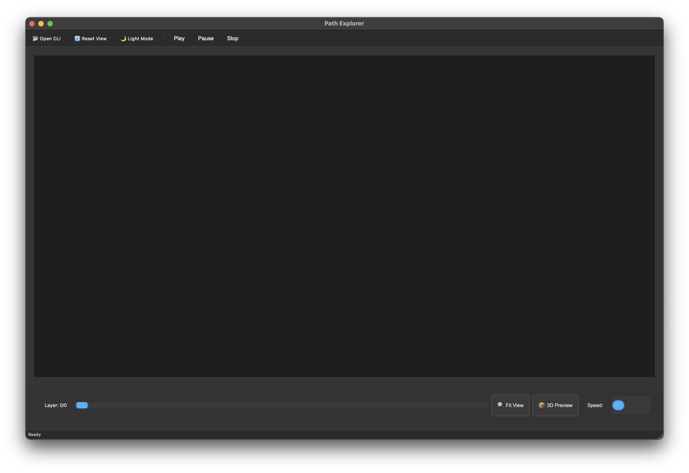
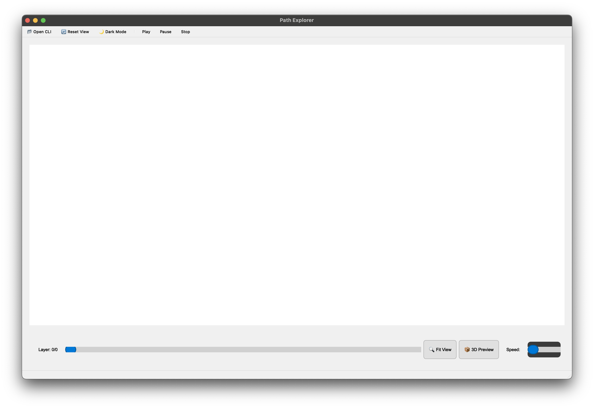

# Project Overview

The Path Explorer is a modern PyQt6-based application designed for visualizing additive manufacturing toolpaths from CLI files. It offers thermal simulation and 3D preview inspection capabilities, allowing for detailed analysis of manufacturing processes.

## Screenshots and demonstration video





## Installation

To simplify the Python environment setup, I recommend using [UV](https://docs.astral.sh/uv/), a virtual environment manager and extremely fast package manager written in Rust. UV consolidates multiple setup steps into one, making it easier to set up the environment. Alternatively, I’ve provided the requirements.txt file for those who prefer using their preferred package manager and setting up a virtual environment as they are accustomed to.

I’ve primarily tested the application on three operating systems:

## macOS 15.5 (ARM V9.2A: Apple Silicone)

Installing a package manager like [Homebrew](https://brew.sh) is highly beneficial on macOS, as it allows you to install many Linux-style programs. After installing Homebrew, follow the next set of commands from the terminal shell, which defaults to zsh:

```zsh
brew install uv
```

MacOS typically comes with Git installed by default. However, if you need to install Git from Homebrew, append “git” to the above command: brew install uv git.

## Windows 11 (Intel)

In the latest versions of Windows, there’s an inbuilt package manager that you can use to download packages like UV and Git.

You can either follow the installation instructions provided on UV’s website or use the following command:

```bash
winget install —id=astral-sh.uv -e
```

Additionally, you need to install Git.

```bash
winget install git.git
```

## Arch Linux (Intel)

```bash
sudo pacman -S uv git
```


## Building path-explorer

Once the system’s global dependencies are met, proceed with the path-explorer project. These steps are consistent across all platforms.

```zsh
git clone https://gitlab.com/chetanpm/path-explorer && cd path-explorer
```

```zsh
uv sync
```

The repository contains a lockfile named uv.lock that lists the required package dependencies and their versions. I tested these versions in the project. UV installs all the dependencies swiftly.

```zsh
uv run .
```

This will launch the GUI. Since UV automatically manages the virtual environment, it creates one, activates it, and runs the scripts. Once the application is terminated, the virtual environment is automatically deactivated.

## Troubleshooting

Running uv run . for the first time may take a few minutes to launch. However, subsequent launches are fast once cached.

If the program doesn’t start or throws errors, try capturing the log using the following command:

```zsh
uv run . 2>&1 | tee parser_debug.log
```

General search results with the log’s errors will help you identify the issue. If you still can’t find a solution, create an issue with the log file, and I’ll search the internet and try to assist you.

If you’re not a fan of using UV, you can create a virtual environment using Python’s venv or conda. Activate the environment by sourcing the activate binary from your VirtualEnvironment/bin/activate directory. Then, run pip install -r requirements.txt to install all the dependencies. Finally, run python __main__.py to launch the GUI.

## Development

The architecture was designed to be modular. The core package consists of cli_parser, heat_model, and theme_manager modules, each enabling different features in the application. More modules can be added to the core to expand its functionality.

The graphical user interface (GUI) package includes main_window, visualization, and styles modules, which are decoupled from the core packages.

The parsing logic is executed on the CPU using the cli_parser script. Rendering is offloaded to pyvista, which uses vtk for abstraction and handling GPU acceleration. It utilizes corresponding acceleration frameworks like Metal on Apple silicon, DirectX on Windows, and OpenGL/Vulkan on Linux.

If you decide to make changes to the code, run ‘uv tool install ruff’ and ‘uv tool run ruff check’ from within the repository. The —fix option can sometimes be used to fix simple syntax errors.
